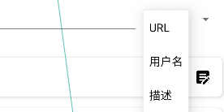
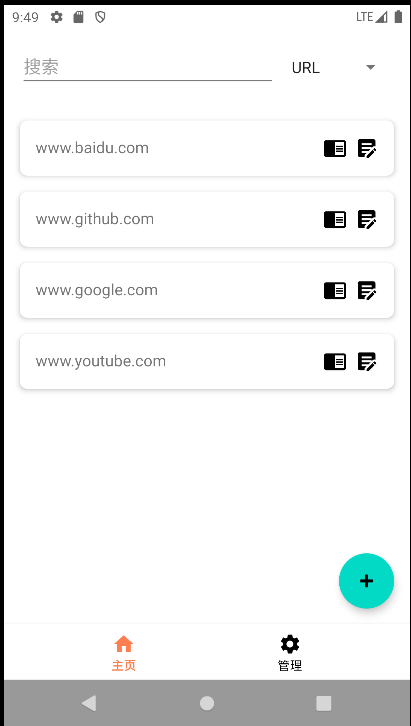
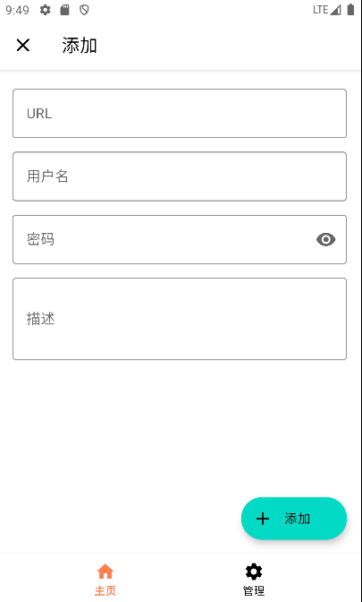
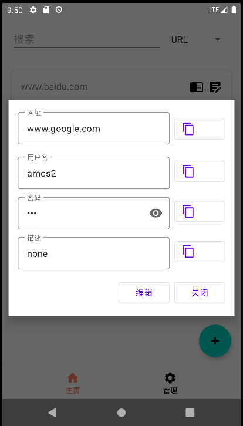
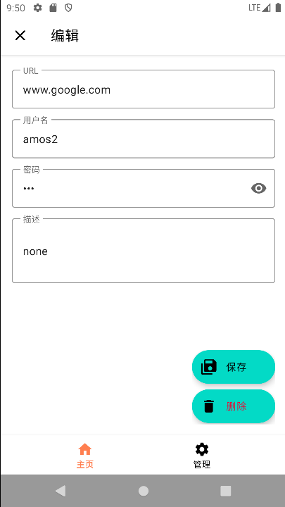
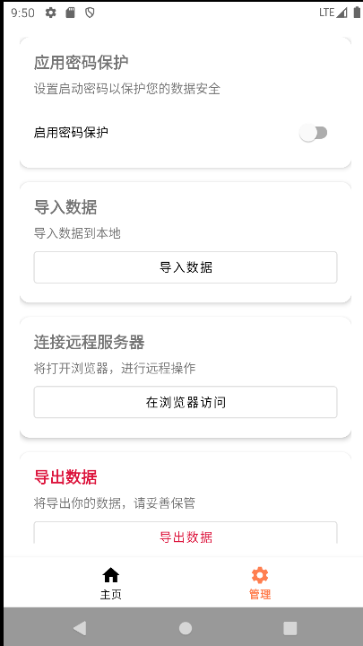
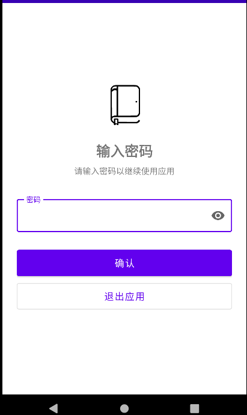

#                                                 CODEBOOK

## 介绍

一款保存用户各种网址的账号密码以及一些其他信息的密码管理工具，目前只提供本地存储功能

作者：amos

项目地址：https://github.com/amos39/CodeBook

作者blog：developing...

## 说明

该软件至少运行在android 11系统上运行，推荐sdk版本为34（对应android 14）

## 功能

### 存储

保存用户名，密码，网址，备注，以及对其的修改，删除功能

### 搜索

搜索范围包括除密码外的内容，您搜索的关键字可以在存储的所有数据中的网址，备注，用户名中

### 排序

展示或是搜索的内容会自动按照字典序进行排序

### 数据导入与导出

#### 导入

从/storage/emulated/0/Android/data/com.amos.codebook3/files/backup下选择文件导入，导入格式为特定的json，

#### 导出

从/storage/emulated/0/Android/data/com.amos.codebook3/files/backup下选择文件导出到应用数据库中，导出格式为特定的json

### 加密

#### 应用启动加密

设置启动密码后应用在启动时需要输入密码来解锁应用，密码以HASH值的形式存储

#### 数据库加密

数据库使用SQLiteCipher提供的加密方式进行加密，用户可以选择是否保存数据库密钥在设备上，如果不保存请一定牢记密码

，以便在使用时输入正确的密钥

#### 密钥相关操作

在进行密钥相关操作后都建议进行一次重启软件的操作

##### 更改密钥

第一次启动时，密钥是随机生成的，建议您首次启动后先修改密钥再正式开始使用，在以后的使用中如需更改密钥请做好数据备份，更改密钥一般不会破环数据库，但仍存在极低概率有这种情况

更改密钥时需要设备上存在旧的密钥

##### 删除密钥

使密钥不再留存本地

##### 输入密钥

当您删除密钥后，下次使用软件时请先使用该功能输入正确密钥

##### 重置数据库

当您实在无法想起数据库密钥时，可以使用该功能删除数据库和密钥相关的内容，以重新使用软件，使用该功能后，所有的数据库中的数据会被删除，但是备份文件不会被清理，注意：卸载软件会清空所有数据，包括数据库中的数据和备份文件数据

## 应用截图

